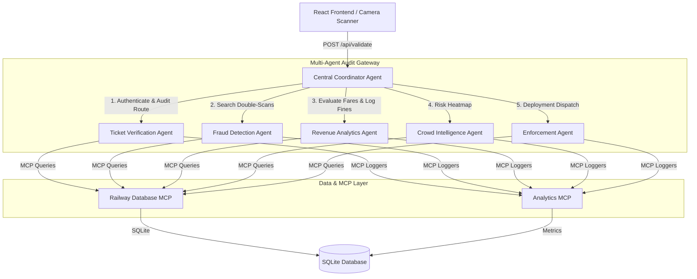

# AI-Powered Railway Revenue Protection Platform (CRIS Revenue Shield)

An enterprise-grade Multi-Agent Intelligence System designed for Indian Railways to automate ticket validation, detect ticket-sharing and recycling fraud, audit protected fare revenues, and optimize Ticket Examiner (TTE) deployments.

This platform serves as a complete Capstone Project demonstration utilizing Google's **Agent Development Kit (ADK)** architecture patterns, **Model Context Protocol (MCP)** tool design, and a modern **FastAPI (Python) + React (TypeScript) + SQLite** monorepo stack.

---

## 🏗️ AI Agent Architecture

The platform separates auditing and validation duties into five specialized autonomous agents coordinated by a central orchestrator:



### Specialized Agents
1. **Central Coordinator Agent**: The central orchestrator that receives scan events, executes rules, triggers sub-agent audits in parallel, compiles logs, and renders the final `ACCESS APPROVED` or `ACCESS DENIED` command.
2. **Ticket Verification Agent**: Audits ticket validity (verifies database existence, journey date compatibility, routing path, and active status) using the **Railway Database MCP**.
3. **Fraud Detection Agent**: Audits double-scans (checking if a ticket is scanned twice within 30 minutes at different gates), expired usage, and cancelled/refunded ticket recycling. Categorizes alerts by risk level (`Low`, `Medium`, `High`, `Critical`).
4. **Revenue Analytics Agent**: Audits fare structures and records revenue saved (valid ticket fare) or leakage prevented (fare + 50% penalty for invalid ticket attempt) using the **Analytics MCP**.
5. **Crowd Intelligence Agent**: Monitors station congestion and computes real-time violation probability risk indexes based on peak rush hours.
6. **Enforcement Agent**: Generates actionable TTE deployment recommendations (e.g. gate patrols) for high-risk flags.

---

## ⚙️ Model Context Protocol (MCP) Tools

To maintain clean separation of concerns, the agents do not directly execute SQLite SQL or modify filesystem assets. Instead, they interact via simulated MCP tools:
* **Railway Database MCP**: Governs queries and logs for passenger profiles and scan histories.
* **Analytics MCP**: Updates financial metrics, counts violation distributions, and updates station statistics.
* **Reporting MCP**: Governs export report generation (CSV/PDF).

---

## 🛠️ Technology Stack

* **Frontend**: React 18, TypeScript, Tailwind CSS, Lucide React (Icons), Recharts (Data Visualizations), `html5-qrcode` (Webcam Scanning).
* **Backend**: Python 3.11+, FastAPI, Uvicorn, SQLAlchemy, Google ADK (Agent Development Kit).
* **Database**: SQLite (relational storage for passengers, logs, alerts, and states).
* **Package Managers**: `npm` (Frontend), `uv` (Fast/Reliable Python package manager).

---

## 🚀 Getting Started

### Prerequisites
Make sure you have the following installed on your system:
* **Node.js** (v18+ recommended)
* **Python** (v3.10 to v3.13)
* **uv** (Python package installer) — [Install uv](https://docs.astral.sh/uv/getting-started/installation/)

---

### Setup Instructions

1. **Clone the Repository**:
   ```bash
   git clone https://github.com/YourUsername/AI-Powered-Railway-Revenue-Protection-Platform.git
   cd AI-Powered-Railway-Revenue-Protection-Platform
   ```

2. **Configure Environment Variables**:
   Copy the example environment files to create your local configurations:
   ```bash
   # Backend config
   cp app/.env.example app/.env

   # Frontend config
   cp app/frontend/.env.example app/frontend/.env
   ```

3. **Install Dependencies**:
   Install both frontend npm packages and backend python requirements in one command:
   ```bash
   npm run install-all
   ```
   *This automatically runs `npm install` inside the frontend directory and `uv sync` inside the backend directory.*

---

### Running the Application

Start both the FastAPI backend and the React frontend concurrently using the root dev script:

```bash
npm run dev
```

* **Vite Frontend Dev Server**: [http://localhost:5173](http://localhost:5173)
* **FastAPI Swagger API Documentation**: [http://localhost:8000/docs](http://localhost:8000/docs)

---

## 🎯 Demonstration Workflow

1. Open [http://localhost:5173](http://localhost:5173) to view the homepage and review the agent system design.
2. Go to the **Entry Validation** tab:
   * **Simulate Valid Scan (TKT001 - Rahul Kumar)**: Returns `ACCESS APPROVED`. Review the "Live Agent Reasoning Feed" to see logs from each auditing agent.
   * **Simulate Route Violation (TKT012 - Sandeep Gupta)**: Returns `ACCESS DENIED` due to a route violation.
   * **Simulate Cancelled Ticket (TKT008 - Ramesh Babu)**: Returns `ACCESS DENIED`. The Fraud Agent flags this as critical risk.
   * **Simulate Double Scan (TKT010 - Rajesh Verma)**: Click "Simulate" once (Approved), then click it again within 30 seconds. The Fraud Agent detects a double scan, raises a `Critical` risk alert, and blocks access.
3. Go to the **Operations Center** tab to examine live statistics: protected revenues, prevented leakages, station load risk multipliers, and daily scan charts.
4. Go to the **Admin Portal** tab:
   * Log in with:
     * **Email**: `admin@railway.com`
     * **Password**: `password123`
   * Audit the passenger registry and live scan log history.
   * Review raised AI Fraud Alerts and click resolve checkmarks.
   * Export the scan report by clicking **Export CSV**.
   * Click **Reset DB** to re-seed the SQLite database to its original state.

---

## 🔮 Future Enhancements

* **On-device QR Processing**: Move frame binarization and QR decoding to WebAssembly (WASM) for lower camera latency.
* **Biometric Fusion**: Add facial recognition checks to link passenger identity with the ticket verification pipeline.
* **Large-scale MCP Deployment**: Connect the backend to production GCP Cloud SQL databases and Vertex AI Agent Engine.

---

## 📄 License

This project is licensed under the MIT License - see the [LICENSE](LICENSE) file for details.
